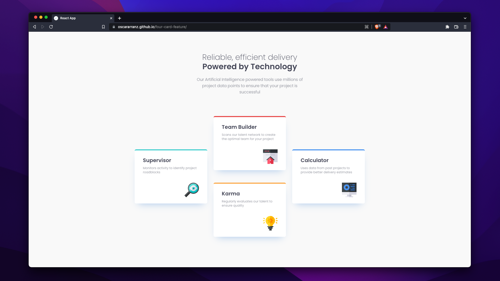
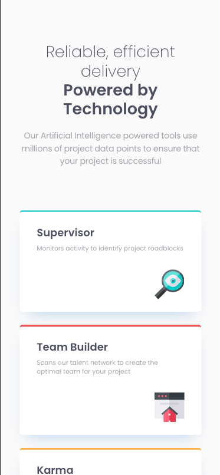

# Frontend Mentor - Four card feature section solution

This is a solution to the [Four card feature section challenge on Frontend Mentor](https://www.frontendmentor.io/challenges/four-card-feature-section-weK1eFYK). Frontend Mentor challenges help you improve your coding skills by building realistic projects.

## Table of contents

- [Overview](#overview)
  - [The challenge](#the-challenge)
  - [Screenshots](#screenshots)
  - [Links](#links)
- [My process](#my-process)
  - [Built with](#built-with)
  - [Useful resources](#useful-resources)
- [Author](#author)
- [Acknowledgments](#acknowledgments)

## Overview

### The challenge

Users should be able to:

- View the optimal layout for the site depending on their device's screen size

### Screenshots

### Links

- Solution URL: [Add solution URL here](https://oscararranz.github.io/four-card-feature/)

## My process

### Built with

- Semantic HTML5 markup
- CSS custom properties
- Flexbox
- CSS Grid
- Mobile-first workflow
- [React](https://reactjs.org/) - Front End JS library to build reactive user interfaces based on UI components
- [Tailwindcss](https://tailwindcss.com/) - Utility first CSS framework class based

### Useful resources

- [CSS-Tricks Grid Guide](https://css-tricks.com/snippets/css/complete-guide-grid/) - I always rely on CSS Tricks guides when I want to use either CSS Grid or CSS Flexbox and forget about some syntax.
- [CSS-Tricks Flexbox Guide](https://css-tricks.com/snippets/css/a-guide-to-flexbox/) - I've found this webpage guides very useful so I link them in case anyone wants to learn.
- [MDN Web Docs](https://developer.mozilla.org/en-US/) - I didn't use MDN Web Docs in this particular project but I really recommend it for an in depth HTML, CSS or JS documentation.
- [Tailwindcss Docs](https://tailwindcss.com/docs/) - If I ever forget about any Tailwindcss class name I just come here to remember it.

## Author

- Website - [Oscar Arranz](https://www.oscararranz.com)
- Frontend Mentor - [@OscarArranz](https://www.frontendmentor.io/profile/OscarArranz)
- LinkedIn - [Oscar Arranz](https://www.linkedin.com/in/oscararranzp/)
